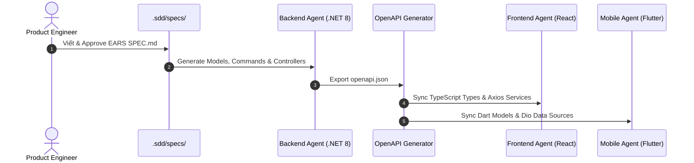

# Giao Thức Đồng Bộ Ngữ Cảnh (Shared Context Protocol)

Tài liệu này là cầu nối duy nhất giữa các AI Agent đảm trách **Backend (.NET 8)**, **Frontend (React)**, và **Mobile (Flutter)**.

---

## 1. Hợp Đồng Dữ Liệu Chung (Unified API Contract)

- Mọi endpoint trả về định dạng chuẩn:
```json
{
  "success": true,
  "data": {},
  "error": null,
  "meta": {
    "timestamp": "2026-09-05T09:00:00Z",
    "correlationId": "uuid-v4"
  }
}
```
- Mã lỗi nghiệp vụ chuẩn hóa:
  - `AUTH_SESSION_EXPIRED`
  - `ASSET_LOCKED_PENDING_ACTIVATION`
  - `UNAUTHORIZED_DELEGATE_ACTION`
  - `CONCURRENT_STATE_MUTATION`

---

## 2. Quy Trình Đồng Bộ Giữa Các Agent


