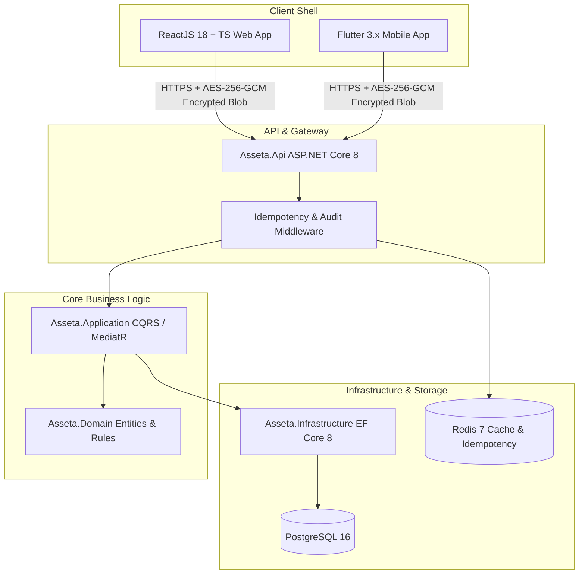
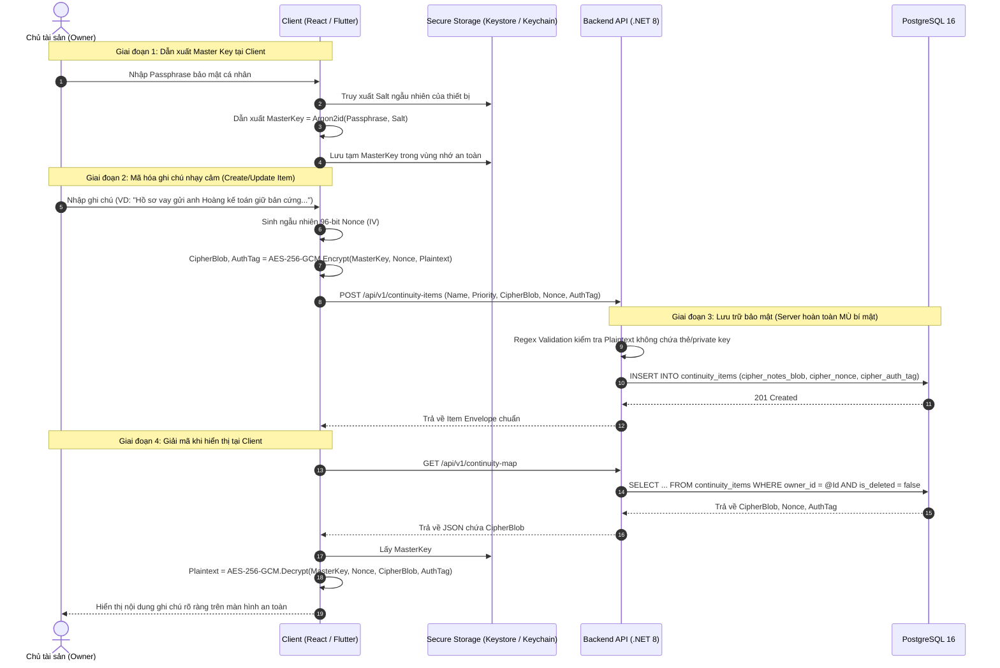

# Kế Hoạch Kiến Trúc & Quy Hoạch Kỹ Thuật (Architecture & Planning): Module 1 – Continuity Map

**Mã Module:** `module1` (Tương đương `feat-01-continuity-map`)  
**Pha phát triển:** Pha 2 – Architecture & Planning  
**Vai trò đảm trách:** Senior Solution Architect & Tech Lead  
**Trạng thái tài liệu:** APPROVED (Đã được phê duyệt bởi Product Engineer - Chuyển sang Pha 3)  

---

## 1. Tiếp Cận Kiến Trúc (Architectural Approach)

Hệ thống được thiết kế theo nguyên tắc phân tầng độc lập, cô lập nghiệp vụ cốt lõi (Core) và các giao diện người dùng ngoại vi (Shell), đảm bảo tính module hóa và dễ kiểm thử.



### 1.1. Phân Tầng Backend (Clean Architecture - .NET 8 LTS)

- **`Asseta.Domain` (Core Domain - Không phụ thuộc bên ngoài)**:
  - Thực thể: `ContinuityCategory`, `ContinuityItem`, `ContinuityAuditLog`.
  - Value Objects: `PriorityLevel` (`CRITICAL`, `IMPORTANT`, `LOW`), `CipherBlobPayload` (`CipherBlob`, `Nonce`, `AuthTag`), `ReadinessScore`.
  - Domain Events: `ContinuityItemCreatedEvent`, `ContinuityItemUpdatedEvent`, `ContinuityItemDeletedEvent`, `ReadinessScoreCalculatedEvent`.
  - Business Rules: Thuật toán xác định Continuity Gap, nguyên tắc bất biến không lưu Plaintext nhạy cảm.
- **`Asseta.Application` (Use Cases & CQRS Handlers - MediatR)**:
  - Queries:
    - `GetContinuityMapQuery`: Lấy toàn bộ cây dữ liệu 6 danh mục, items và điểm Readiness Score.
    - `GetContinuityItemByIdQuery`: Lấy chi tiết một hạng mục.
    - `GetContinuityGapsQuery`: Lọc danh sách các hạng mục Critical/Important bị thiếu thông tin.
  - Commands:
    - `CreateContinuityItemCommand`: Tạo mới hạng mục kèm `Idempotency-Key`.
    - `UpdateContinuityItemCommand`: Cập nhật hạng mục kèm kiểm tra `RowVersion`.
    - `DeleteContinuityItemCommand`: Soft-delete hạng mục và cập nhật điểm số.
    - `ReorderContinuityItemsCommand`: Cập nhật chỉ số `SortOrder`.
    - `SubmitContinuityAssessmentCommand`: Khởi tạo bản đồ tự động từ kết quả khảo sát.
  - Pipeline Behaviors:
    - `ValidationBehavior`: Tự động validate bằng FluentValidation.
    - `LoggingAndAuditBehavior`: Tự động ghi nhận `continuity_audit_logs`.
- **`Asseta.Infrastructure` (Data Access & Services)**:
  - EF Core 8 `DbContext` ánh xạ PostgreSQL 16 sử dụng Snake_Case.
  - Quản lý giao dịch nguyên tử (Atomic Transactions) và cấu hình `RowVersion` cho Concurrency Token.
  - `RedisIdempotencyService`: Lưu trữ kết quả request theo `Idempotency-Key` với TTL 24 giờ.
- **`Asseta.Api` (Presentation)**:
  - `ContinuityMapController`, `ContinuityItemsController`.
  - Global Exception Handling Middleware trả về Envelope chuẩn (`shared_context.md`).

### 1.2. Phân Tầng Frontend Web (React 18 + Vite + TypeScript)

- **Kiến trúc Feature-First**: `src/features/ContinuityMap/`
  - `api/`: Các hàm gọi API qua Axios instance (`getContinuityMap`, `createContinuityItem`,...).
  - `components/`:
    - `ContinuityOverviewCard`: Hiển thị chỉ số Readiness Score tổng thể và từng danh mục.
    - `CategorySection`: Danh sách các accordion của 6 nhóm danh mục chuẩn.
    - `ContinuityItemCard`: Hiển thị từng item, nhãn ưu tiên, cảnh báo Gap.
    - `ContinuityGapAlert`: Khối thông báo các việc cấp bách chưa hoàn thành.
    - `ItemFormModal`: Modal thêm/sửa item với tích hợp mã hóa tự động trước khi submit.
  - `hooks/`: TanStack Query custom hooks (`useContinuityMap`, `useCreateItem`,...).
  - `crypto/`: Triển khai Web Crypto API (AES-256-GCM) để mã hóa client-side các ghi chú mật.

### 1.3. Phân Tầng Mobile App (Flutter 3.x + BLoC Pattern)

- **Phân lớp Clean Architecture**:
  - `features/continuity_map/presentation/`:
    - BLoC: `ContinuityMapBloc`, `ContinuityMapEvent`, `ContinuityMapState`.
    - Pages: `ContinuityMapScreen`, `ContinuityAssessmentScreen`, `ItemDetailScreen`.
  - `features/continuity_map/domain/`:
    - UseCases: `GetContinuityMapUseCase`, `CreateItemUseCase`, `CalculateReadinessLocallyUseCase`.
  - `features/continuity_map/data/`:
    - DataSources: `ContinuityRemoteDataSource` (Dio), `ContinuityLocalDataSource` (Hive/SQLite cho offline cache).
  - `core/crypto/`: Mã hóa AES-256-GCM sử dụng khóa Master Key được lưu an toàn trong `flutter_secure_storage`.

---

## 2. Thiết Kế Cơ Sở Dữ Liệu Chi Tiết (PostgreSQL 16 Schema)

Mọi bảng sử dụng kiểu định danh khóa chính `UUIDv4`, quản lý thời gian bằng `TIMESTAMPTZ` (chuẩn UTC).

```sql
-- Kích hoạt extension sinh UUID
CREATE EXTENSION IF NOT EXISTS "uuid-ossp";

-- 1. Bảng danh mục tiếp quản cố định (Seed 6 nhóm chuẩn)
CREATE TABLE continuity_categories (
    id UUID PRIMARY KEY DEFAULT gen_random_uuid(),
    code VARCHAR(50) NOT NULL UNIQUE,
    name_vi VARCHAR(100) NOT NULL,
    name_en VARCHAR(100) NOT NULL,
    icon VARCHAR(50) NOT NULL,
    sort_order INT NOT NULL DEFAULT 0,
    created_at TIMESTAMPTZ NOT NULL DEFAULT CURRENT_TIMESTAMP
);

-- 2. Bảng hạng mục tiếp quản
CREATE TABLE continuity_items (
    id UUID PRIMARY KEY DEFAULT gen_random_uuid(),
    owner_id UUID NOT NULL,
    category_id UUID NOT NULL REFERENCES continuity_categories(id) ON DELETE RESTRICT,
    name VARCHAR(200) NOT NULL,
    priority VARCHAR(20) NOT NULL CHECK (priority IN ('CRITICAL', 'IMPORTANT', 'LOW')),
    document_location_hint VARCHAR(255) NULL,
    assigned_trusted_person_id UUID NULL,
    action_card_id UUID NULL,
    cipher_notes_blob TEXT NULL,
    cipher_nonce VARCHAR(64) NULL,
    cipher_auth_tag VARCHAR(64) NULL,
    sort_order INT NOT NULL DEFAULT 0,
    is_completed BOOLEAN NOT NULL DEFAULT FALSE,
    is_deleted BOOLEAN NOT NULL DEFAULT FALSE,
    row_version INT NOT NULL DEFAULT 1,
    created_at TIMESTAMPTZ NOT NULL DEFAULT CURRENT_TIMESTAMP,
    updated_at TIMESTAMPTZ NOT NULL DEFAULT CURRENT_TIMESTAMP,
    deleted_at TIMESTAMPTZ NULL
);

-- Chỉ mục tối ưu truy vấn
CREATE INDEX idx_continuity_items_owner_deleted ON continuity_items(owner_id, is_deleted) 
    INCLUDE (category_id, priority, is_completed, sort_order);
CREATE INDEX idx_continuity_items_category ON continuity_items(category_id);
CREATE INDEX idx_continuity_items_action_card ON continuity_items(action_card_id) 
    WHERE action_card_id IS NOT NULL;

-- 3. Bảng nhật ký kiểm toán bất biến
CREATE TABLE continuity_audit_logs (
    id UUID PRIMARY KEY DEFAULT gen_random_uuid(),
    owner_id UUID NOT NULL,
    item_id UUID NULL,
    action VARCHAR(50) NOT NULL,
    payload_snapshot JSONB NOT NULL,
    ip_address VARCHAR(45) NULL,
    correlation_id UUID NOT NULL,
    created_at TIMESTAMPTZ NOT NULL DEFAULT CURRENT_TIMESTAMP
);

CREATE INDEX idx_continuity_audit_logs_owner_time ON continuity_audit_logs(owner_id, created_at DESC);

-- 4. Bảng lưu trữ lịch sử khảo sát tiếp quản (Assessment History)
CREATE TABLE continuity_assessment_history (
    id UUID PRIMARY KEY DEFAULT gen_random_uuid(),
    owner_id UUID NOT NULL,
    assessment_version VARCHAR(20) NOT NULL DEFAULT 'v1',
    raw_responses JSONB NOT NULL,
    items_generated_count INT NOT NULL DEFAULT 0,
    initial_readiness_score INT NOT NULL DEFAULT 0,
    created_at TIMESTAMPTZ NOT NULL DEFAULT CURRENT_TIMESTAMP
);

CREATE INDEX idx_continuity_assessment_history_owner ON continuity_assessment_history(owner_id, created_at DESC);
```

---

## 3. Hợp Đồng API Chi Tiết (API Contracts)

Toàn bộ API tuân thủ tiêu chuẩn Envelope:

- Header bắt buộc: `Authorization: Bearer <JWT>`, `X-Correlation-Id: <UUIDv4>`.
- Header bổ sung cho mutation: `Idempotency-Key: <UUIDv4>`.

### 3.1. `GET /api/v1/continuity-map`

Lấy cấu trúc toàn bộ cây dữ liệu bản đồ tiếp quản, điểm số và các cảnh báo gap.

- **Response 200 OK**:

```json
{
  "success": true,
  "data": {
    "overallReadinessScore": 65,
    "totalItems": 12,
    "totalGaps": 3,
    "categories": [
      {
        "categoryId": "018e6e5a-7341-789a-9e12-2d93e1104e01",
        "code": "FINANCIAL",
        "name": "Tài chính & Nghĩa vụ tiền tệ",
        "icon": "wallet",
        "readinessScore": 50,
        "items": [
          {
            "id": "018e6e5a-7341-789a-9e12-2d93e1104e10",
            "name": "Khoản vay thế chấp Vietcombank *8892",
            "priority": "CRITICAL",
            "documentLocationHint": "Tủ hồ sơ phòng làm việc",
            "assignedTrustedPersonId": null,
            "actionCardId": null,
            "hasConfidentialNotes": true,
            "isCompleted": false,
            "hasContinuityGap": true,
            "rowVersion": 1,
            "sortOrder": 1
          }
        ]
      }
    ],
    "gaps": [
      {
        "itemId": "018e6e5a-7341-789a-9e12-2d93e1104e10",
        "itemName": "Khoản vay thế chấp Vietcombank *8892",
        "categoryCode": "FINANCIAL",
        "priority": "CRITICAL",
        "missingFields": ["assignedTrustedPersonId"]
      }
    ]
  },
  "error": null,
  "meta": {
    "timestamp": "2026-09-05T10:45:00Z",
    "correlationId": "8f3b2075-8b89-436f-b258-89c09c253db1"
  }
}
```

### 3.2. `POST /api/v1/continuity-items`

Tạo mới một hạng mục tiếp quản.

- **Headers**: `Idempotency-Key: d7b27fc2-75d3-4f93-b26a-200787a93510`
- **Request Body**:

```json
{
  "categoryId": "018e6e5a-7341-789a-9e12-2d93e1104e01",
  "name": "Hợp đồng thuê nhà căn 1204 Masteri",
  "priority": "IMPORTANT",
  "documentLocationHint": "Lưu file PDF trên Google Drive cá nhân",
  "assignedTrustedPersonId": "018e6e5a-7341-789a-9e12-2d93e1104f99",
  "cipherNotesBlob": "U2FsdGVkX1+...encrypted_payload...",
  "cipherNonce": "e4d7a8b9c0d1e2f3",
  "cipherAuthTag": "a1b2c3d4e5f6g7h8i9j0"
}
```

- **Response 201 Created**: Trả về dữ liệu hạng mục đã tạo kèm `id` và điểm số danh mục mới.
- **Response 400 Bad Request**: Trả về chi tiết validation nếu thiếu `name` hoặc `categoryId` không hợp lệ.
- **Response 422 Unprocessable Entity**: Trả về lỗi `SENSITIVE_DATA_DETECTED` nếu trường văn bản chứa số thẻ tín dụng hoặc private key chưa mã hóa.

### 3.3. `PUT /api/v1/continuity-items/{id}`

Cập nhật hạng mục tiếp quản có kiểm tra Concurrency Token.

- **Headers**: `Idempotency-Key: <UUIDv4>`
- **Request Body**:

```json
{
  "name": "Hợp đồng thuê nhà căn 1204 Masteri Thảo Điền",
  "priority": "IMPORTANT",
  "documentLocationHint": "Ngăn kéo bàn làm việc tầng 2",
  "assignedTrustedPersonId": "018e6e5a-7341-789a-9e12-2d93e1104f99",
  "cipherNotesBlob": "U2FsdGVkX1+...updated_blob...",
  "cipherNonce": "f1e2d3c4b5a60789",
  "cipherAuthTag": "0987654321abcdef",
  "rowVersion": 1
}
```

- **Response 200 OK**: Cập nhật thành công, trả về dữ liệu mới và tăng `rowVersion` lên 2.
- **Response 409 Conflict**: Xung đột phiên bản nếu `rowVersion` trong DB khác 1 (`CONCURRENT_STATE_MUTATION`).

### 3.4. `DELETE /api/v1/continuity-items/{id}`

Soft-delete một hạng mục tiếp quản.

- **Response 200 OK**: Trả về thông báo thành công và điểm Readiness Score đã được tính toán lại.
- **Response 404 Not Found**: Hạng mục không tồn tại hoặc đã bị xóa trước đó.

---

## 4. Luồng Mật Mã Phía Client & Zero-Knowledge (Cryptographic Flow)

Để đảm bảo nguyên tắc Zero-Knowledge & Non-Possession, máy chủ Asseta hoàn toàn không nắm giữ bản rõ của các ghi chú nhạy cảm hay Master Key.



---

## 5. Phân Tích Rủi Ro Kỹ Thuật & Phương Án Giảm Thiểu (Risks & Mitigation)

| STT | Rủi ro kỹ thuật (Technical Risk) | Mức độ | Hậu quả tiềm tàng | Phương án xử lý & Giảm thiểu (Mitigation) |
| :--- | :--- | :--- | :--- | :--- |
| **1** | **Mất Master Key phía Client** | Nghiêm trọng | Nếu người dùng quên Passphrase và đổi thiết bị, toàn bộ `CipherBlob` ghi chú không thể giải mã. | Triển khai Recovery Mnemonic (12-word seed phrase) hiển thị duy nhất 1 lần khi thiết lập Master Key. Tách biệt rõ ràng: Nếu mất key, chỉ mất ghi chú bí mật; các thông tin cấu trúc tiếp quản (tên mục, vị trí hồ sơ vật lý, người phụ trách) vẫn nguyên vẹn. |
| **2** | **Lệch điểm Readiness Score giữa Offline và Server** | Trung bình | Người dùng di động cập nhật khi offline tính ra 80%, khi có mạng sync lên server lại thành 75% gây hoang mang. | Đóng gói bộ thư viện tính điểm toán học (`ReadinessScoreCalculator`) với cùng một bộ quy tắc logic và bộ test vector trên cả C# (Backend) và Dart (Flutter). Khi trực tuyến, Server là nguồn thẩm định cuối (authoritative source). |
| **3** | **Xung đột ghi đè đồng thời (Concurrent Mutation)** | Trung bình | Người dùng mở cả Web và Mobile cùng sửa một mục dẫn đến mất mát dữ liệu đến sau (Last-Write-Wins). | Triển khai Optimistic Concurrency Control thông qua trường `row_version`. Nếu phiên bản client gửi lên lệch với database, API trả về HTTP 409 Conflict và thông báo cho client tải lại dữ liệu mới nhất. |
| **4** | **Tấn công Replay Attack hoặc Mạng chập chờn** | Thấp | Ứng dụng gửi lại yêu cầu POST nhiều lần gây trùng lặp hàng loạt Continuity Item. | Áp dụng Idempotency Key Middleware với Redis cache (TTL 24h). Áp dụng Distributed Lock ngắn hạn (5 giây) theo `Key` để đảm bảo chỉ có duy nhất 1 luồng xử lý command tại một thời điểm. |

---

## 6. Kết Quả Phê Duyệt & Quyết Định Kỹ Thuật (Approved Decisions)

1. **Lưu trữ lịch sử khảo sát (`continuity_assessment_history`)**:
   - **Quyết định:** ĐỒNG Ý. Hệ thống bổ sung bảng `continuity_assessment_history` lưu trữ bản ghi thô JSONB, điểm số ban đầu và số lượng items được tự động sinh ra cho mỗi lần người dùng thực hiện khảo sát.
2. **Cơ chế đồng bộ trạng thái giữa Web và Mobile**:
   - **Quyết định:** Giữ mô hình RESTful polling / TanStack Query cache invalidation trên Web và Pull-to-refresh trên Mobile để giữ kiến trúc MVP gọn nhẹ, ổn định và tối ưu chi phí vận hành.

---

✅ **GATEKEEPER 1 COMPLETED**: Kế hoạch kỹ thuật đã được Product Engineer phê duyệt chính thức. Sẵn sàng cho Pha 3 (Task Decomposition).

