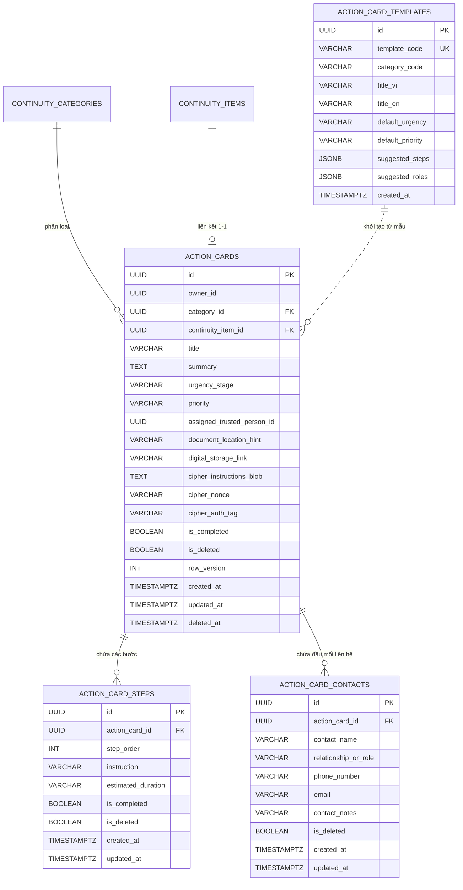
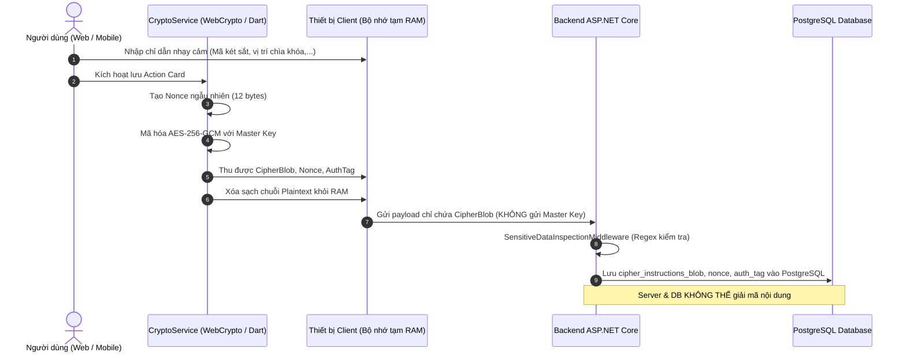

# Kế Hoạch Kiến Trúc & Quy Hoạch Kỹ Thuật (Architecture & Planning): Module 2 – Action Cards

**Mã Module:** `module2` (Tương đương `feat-02-action-cards`)  
**Pha phát triển:** Pha 2 – Architecture & Planning  
**Vai trò đảm trách:** Principal Solution Architect & Senior Tech Lead  
**Tài liệu căn cứ:** [SPEC.md](file:///c:/DevFlutter/asseta-monorepo/.sdd/specs/module2/SPEC.md), [CONTEXT.md](file:///c:/DevFlutter/asseta-monorepo/.sdd/specs/module2/CONTEXT.md)  
**Trạng thái tài liệu:** PENDING HUMAN REVIEW (Chờ Gatekeeper 1 phê duyệt trước khi chuyển sang Pha 3)  

---

## 1. Tiếp Cận Kiến Trúc (Architectural Approach)

Hệ thống tuân thủ nghiêm ngặt mô hình **Core & Shell** và **Clean Architecture (.NET 8 LTS)**, bảo đảm tính độc lập giữa nghiệp vụ cốt lõi, bảo mật Zero-Knowledge, và các phân hệ giao diện người dùng ngoại vi.

```mermaid
graph TD
    subgraph Client Shell (Mã hóa Client-Side & UI)
        Web[ReactJS 18 + WebCrypto API]
        Mobile[Flutter 3.x + Dart Cryptography]
    end

    subgraph API Gateway & Middlewares
        API[Asseta.Api Controllers]
        IdempMw[IdempotencyMiddleware - Redis TTL 24h]
        SecMw[SensitiveDataInspectionMiddleware - Regex Filter]
        ErrMw[GlobalExceptionMiddleware - Envelope Format]
    end

    subgraph Core Business Layer (Clean Architecture)
        App[Asseta.Application CQRS / MediatR]
        Domain[Asseta.Domain Entities, Rules & Events]
    end

    subgraph Infrastructure & Persistence
        Infra[Asseta.Infrastructure EF Core 8]
        Postgres[(PostgreSQL 16 Storage)]
        Redis[(Redis 7 Distributed Lock & Cache)]
    end

    Web -->|HTTPS + AES-256-GCM Encrypted Instructions| API
    Mobile -->|HTTPS + AES-256-GCM Encrypted Instructions| API
    API --> ErrMw
    ErrMw --> SecMw
    SecMw --> IdempMw
    IdempMw --> App
    App --> Domain
    App --> Infra
    Infra --> Postgres
    IdempMw --> Redis
```

---

## 2. Thiết Kế Cơ Sở Dữ Liệu Chi Tiết (PostgreSQL 16 Schema)

Mô hình dữ liệu của Module 2 mở rộng cơ sở dữ liệu `asseta_db` với 4 bảng: `action_cards`, `action_card_steps`, `action_card_contacts`, và `action_card_templates`.



### 2.1. DDL Script Chi Tiết

```sql
-- 1. Bảng action_cards
CREATE TABLE IF NOT EXISTS action_cards (
    id UUID PRIMARY KEY DEFAULT gen_random_uuid(),
    owner_id UUID NOT NULL,
    category_id UUID NOT NULL REFERENCES continuity_categories(id) ON DELETE RESTRICT,
    continuity_item_id UUID NULL REFERENCES continuity_items(id) ON DELETE SET NULL,
    title VARCHAR(200) NOT NULL,
    summary TEXT NULL,
    urgency_stage VARCHAR(30) NOT NULL CHECK (urgency_stage IN ('IMMEDIATE', 'FIRST_72_HOURS', 'FIRST_7_DAYS', 'LONGER_TERM')),
    priority VARCHAR(20) NOT NULL CHECK (priority IN ('CRITICAL', 'IMPORTANT', 'LOW')),
    assigned_trusted_person_id UUID NULL,
    document_location_hint VARCHAR(255) NULL,
    digital_storage_link VARCHAR(500) NULL,
    cipher_instructions_blob TEXT NULL,
    cipher_nonce VARCHAR(64) NULL,
    cipher_auth_tag VARCHAR(64) NULL,
    is_completed BOOLEAN NOT NULL DEFAULT FALSE,
    is_deleted BOOLEAN NOT NULL DEFAULT FALSE,
    row_version INT NOT NULL DEFAULT 1,
    created_at TIMESTAMPTZ NOT NULL DEFAULT CURRENT_TIMESTAMP,
    updated_at TIMESTAMPTZ NULL,
    deleted_at TIMESTAMPTZ NULL
);

CREATE INDEX IF NOT EXISTS idx_action_cards_owner_deleted ON action_cards(owner_id, is_deleted);
CREATE INDEX IF NOT EXISTS idx_action_cards_urgency ON action_cards(urgency_stage);
CREATE INDEX IF NOT EXISTS idx_action_cards_continuity_item ON action_cards(continuity_item_id);

-- 2. Bảng action_card_steps
CREATE TABLE IF NOT EXISTS action_card_steps (
    id UUID PRIMARY KEY DEFAULT gen_random_uuid(),
    action_card_id UUID NOT NULL REFERENCES action_cards(id) ON DELETE CASCADE,
    step_order INT NOT NULL,
    instruction VARCHAR(500) NOT NULL,
    estimated_duration VARCHAR(50) NULL,
    is_completed BOOLEAN NOT NULL DEFAULT FALSE,
    is_deleted BOOLEAN NOT NULL DEFAULT FALSE,
    created_at TIMESTAMPTZ NOT NULL DEFAULT CURRENT_TIMESTAMP,
    updated_at TIMESTAMPTZ NULL
);

CREATE INDEX IF NOT EXISTS idx_action_card_steps_card_order ON action_card_steps(action_card_id, step_order);

-- 3. Bảng action_card_contacts
CREATE TABLE IF NOT EXISTS action_card_contacts (
    id UUID PRIMARY KEY DEFAULT gen_random_uuid(),
    action_card_id UUID NOT NULL REFERENCES action_cards(id) ON DELETE CASCADE,
    contact_name VARCHAR(150) NOT NULL,
    relationship_or_role VARCHAR(100) NOT NULL,
    phone_number VARCHAR(30) NULL,
    email VARCHAR(150) NULL,
    contact_notes VARCHAR(255) NULL,
    is_deleted BOOLEAN NOT NULL DEFAULT FALSE,
    created_at TIMESTAMPTZ NOT NULL DEFAULT CURRENT_TIMESTAMP,
    updated_at TIMESTAMPTZ NULL
);

CREATE INDEX IF NOT EXISTS idx_action_card_contacts_card ON action_card_contacts(action_card_id);

-- 4. Bảng action_card_templates (Mẫu dựng sẵn)
CREATE TABLE IF NOT EXISTS action_card_templates (
    id UUID PRIMARY KEY DEFAULT gen_random_uuid(),
    template_code VARCHAR(50) NOT NULL UNIQUE,
    category_code VARCHAR(50) NOT NULL,
    title_vi VARCHAR(200) NOT NULL,
    title_en VARCHAR(200) NOT NULL,
    default_urgency VARCHAR(30) NOT NULL,
    default_priority VARCHAR(20) NOT NULL,
    suggested_steps JSONB NOT NULL,
    suggested_roles JSONB NOT NULL,
    created_at TIMESTAMPTZ NOT NULL DEFAULT CURRENT_TIMESTAMP
);
```

### 2.2. Dữ Liệu Hạt Giống Mẫu (Seed Data cho Templates)

Khởi tạo sẵn 6 Templates tiêu chuẩn tương ứng với 6 danh mục tiếp quản:
1. `TPL_BANK_LOAN` (Tài chính): Xử lý khoản vay & nghĩa vụ trả nợ ngân hàng.
2. `TPL_RENTAL_PROPERTY` (Tài sản): Quản lý nhà/bất động sản cho thuê và người thuê.
3. `TPL_LIFE_INSURANCE` (Bảo hiểm): Khai báo và yêu cầu bồi thường bảo hiểm nhân thọ/sức khỏe.
4. `TPL_BUSINESS_OPS` (Doanh nghiệp): Ủy quyền điều hành khẩn cấp & phê duyệt thanh toán đối tác.
5. `TPL_LEGAL_DOCS` (Hồ sơ): Tiếp cận tủ hồ sơ pháp lý, di chúc, giấy tờ sở hữu gốc.
6. `TPL_FAMILY_SUPPORT` (Gia đình): Duy trì học phí, chi phí sinh hoạt người phụ thuộc.

---

## 3. Thiết Kế Chi Tiết Phân Tầng Backend (.NET 8 Clean Architecture)

### 3.1. Phân Tầng Domain (`Asseta.Domain`)

- **Entities**:
  - `ActionCard`: Kế thừa `BaseEntity`, đóng gói nghiệp vụ cập nhật các bước, gán người tiếp quản, tính toán trạng thái `IsComplete`.
  - `ActionCardStep`: Đại diện cho một bước hành động, quản lý thứ tự `StepOrder` và trạng thái `IsCompleted`.
  - `ActionCardContact`: Đại diện cho một đầu mối liên hệ khẩn cấp (tối đa 5 đầu mối).
  - `ActionCardTemplate`: Thực thể mẫu dựng sẵn (read-only).
- **Enums & Value Objects**:
  - `UrgencyStage`: `IMMEDIATE`, `FIRST_72_HOURS`, `FIRST_7_DAYS`, `LONGER_TERM`.
  - `PriorityLevel`: `CRITICAL`, `IMPORTANT`, `LOW` (tái sử dụng từ Module 1).
  - `CipherBlobPayload`: Đóng gói `(Blob, Nonce, AuthTag)` bất biến.
- **Domain Events**:
  - `ActionCardCreatedEvent`: Phát sinh khi tạo thẻ hành động.
  - `ActionCardCompletedEvent`: Phát sinh khi thẻ có đủ các điều kiện cần thiết, kích hoạt xóa cờ Gap cho `ContinuityItem` liên kết.
  - `ActionCardDeletedEvent`: Phát sinh khi xóa thẻ hành động.

### 3.2. Phân Tầng Application (`Asseta.Application`)

Triển khai CQRS với MediatR và FluentValidation:

#### Commands
- `CreateActionCardCommand`: Tạo Action Card độc lập hoặc liên kết từ `ContinuityItemId`.
- `UpdateActionCardCommand`: Cập nhật tiêu đề, khung thời gian, người phụ trách, ghi chú mật mã (kèm Concurrency Token `RowVersion`).
- `DeleteActionCardCommand`: Xóa mềm thẻ và cascade các bước/contacts liên quan.
- `AddActionStepCommand`: Thêm một bước mới vào cuối checklist.
- `UpdateActionStepCommand`: Sửa nội dung hoặc đánh dấu hoàn tất bước hành động.
- `DeleteActionStepCommand`: Xóa một bước và tự động dồn lại thứ tự `StepOrder`.
- `ReorderActionStepsCommand`: Nhận danh sách `OrderedStepIds` để cập nhật lại thứ tự hiển thị.
- `AddKeyContactCommand`: Gắn đầu mối liên hệ khẩn cấp (tối đa 5).
- `DeleteKeyContactCommand`: Xóa đầu mối liên hệ.

#### Queries
- `GetActionCardsQuery`: Lấy danh sách Action Cards hỗ trợ bộ lọc `UrgencyStage`, `CategoryId`, tìm kiếm từ khóa và phân trang.
- `GetActionCardByIdQuery`: Lấy chi tiết đầy đủ của một Action Card bao gồm các bước và danh bạ liên hệ.
- `GetActionCardTemplatesQuery`: Lấy danh sách các mẫu template có sẵn theo `categoryCode`.

---

## 4. Đặc Tả Giao Diện Lập Trình Ứng Dụng (API Contracts)

Toàn bộ các endpoint sử dụng tiền tố `/api/v1/action-cards`, trả về chuẩn Envelope.

### 4.1. Danh Sách Endpoints

| Phương thức | Đường dẫn Endpoint | Mô tả chức năng | Headers bắt buộc |
| :--- | :--- | :--- | :--- |
| `GET` | `/api/v1/action-cards` | Lấy danh sách Action Cards (lọc theo `urgency`, `category`, phân trang) | `X-Correlation-Id` |
| `GET` | `/api/v1/action-cards/{id}` | Lấy chi tiết một Action Card kèm các bước và contacts | `X-Correlation-Id` |
| `POST` | `/api/v1/action-cards` | Tạo Action Card mới (độc lập hoặc từ `continuityItemId`) | `Idempotency-Key` |
| `PUT` | `/api/v1/action-cards/{id}` | Cập nhật Action Card (tiêu đề, khung thời gian, cipher) | `Idempotency-Key` |
| `DELETE` | `/api/v1/action-cards/{id}` | Xóa mềm Action Card | `Idempotency-Key` |
| `POST` | `/api/v1/action-cards/{id}/steps` | Thêm bước hành động mới vào checklist | `Idempotency-Key` |
| `PUT` | `/api/v1/action-cards/{id}/steps/{stepId}` | Cập nhật nội dung hoặc trạng thái bước hành động | `Idempotency-Key` |
| `DELETE` | `/api/v1/action-cards/{id}/steps/{stepId}` | Xóa bước hành động | `Idempotency-Key` |
| `PUT` | `/api/v1/action-cards/{id}/steps/reorder` | Sắp xếp lại thứ tự các bước hành động | `Idempotency-Key` |
| `POST` | `/api/v1/action-cards/{id}/contacts` | Thêm đầu mối liên hệ khẩn cấp (tối đa 5) | `Idempotency-Key` |
| `DELETE` | `/api/v1/action-cards/{id}/contacts/{contactId}` | Xóa đầu mối liên hệ | `Idempotency-Key` |
| `GET` | `/api/v1/action-cards/templates` | Lấy danh sách các mẫu template dựng sẵn | `X-Correlation-Id` |

### 4.2. Chi Tiết Request / Response Envelope

#### `POST /api/v1/action-cards`
```json
// Request Body
{
  "continuityItemId": "8a32d184-e421-4f10-91a5-814c1fa91111", // optional
  "categoryId": "11111111-1111-1111-1111-111111111111",
  "title": "Xử lý khoản vay thế chấp mua nhà Vietcombank",
  "summary": "Khoản vay mua nhà số đuôi *9876 cần đóng lãi ngày 15 hàng tháng",
  "urgencyStage": "FIRST_72_HOURS",
  "priority": "CRITICAL",
  "assignedTrustedPersonId": "018e6e5a-7341-789a-9e12-2d93e1104e01",
  "documentLocationHint": "Tủ hồ sơ phòng làm việc, ngăn thứ hai",
  "digitalStorageLink": "https://vault.example.com/docs/vcb-loan",
  "cipherInstructionsBlob": "a8fbc39...", // Encrypted AES-256-GCM
  "cipherNonce": "12_bytes_hex",
  "cipherAuthTag": "16_bytes_hex",
  "initialSteps": [
    { "stepOrder": 1, "instruction": "Liên hệ cán bộ tín dụng VCB để kiểm tra dư nợ", "estimatedDuration": "30 phút" },
    { "stepOrder": 2, "instruction": "Chuẩn bị hợp đồng tín dụng gốc trong tủ hồ sơ", "estimatedDuration": "15 phút" }
  ],
  "initialContacts": [
    { "contactName": "Trần Văn B", "relationshipOrRole": "Cán bộ tín dụng VCB", "phoneNumber": "0912345678", "email": "b.tv@vcb.com" }
  ]
}
```

```json
// Response Envelope (201 Created)
{
  "success": true,
  "data": {
    "id": "e932b112-990a-4122-811c-1a2b3c4d5e6f",
    "continuityItemId": "8a32d184-e421-4f10-91a5-814c1fa91111",
    "categoryId": "11111111-1111-1111-1111-111111111111",
    "title": "Xử lý khoản vay thế chấp mua nhà Vietcombank",
    "urgencyStage": "FIRST_72_HOURS",
    "priority": "CRITICAL",
    "isCompleted": false,
    "rowVersion": 1,
    "stepsCount": 2,
    "contactsCount": 1,
    "createdAt": "2026-09-05T12:00:00Z"
  },
  "error": null,
  "meta": {
    "timestamp": "2026-09-05T12:00:00Z",
    "correlationId": "8f3b2075-8b89-436f-b258-89c09c253db1"
  }
}
```

---

## 5. Luồng Mật Mã Phía Client (Client-Side Cryptographic Flow)

Tuân thủ nghiêm ngặt nguyên tắc **Zero-Knowledge**:



---

## 6. Kiến Trúc Giao Diện Người Dùng (Frontend Web & Mobile App)

### 6.1. Frontend Web (React 18 + Vite + TypeScript)

Thư mục: `frontend-web/src/features/ActionCard/`
- **`components/`**:
  - `ActionCardTimelineView.tsx`: Hiển thị các thẻ hành động được phân nhóm theo 4 cột/timeline: `Immediate` (Khẩn cấp ngay), `First 72 Hours`, `First 7 Days`, `Longer Term`.
  - `ActionCardDetailModal.tsx`: Xem chi tiết thẻ, tích hợp checklist đánh dấu hoàn tất các bước, danh bạ đầu mối liên hệ và nút mở khóa giải mã chỉ dẫn bí mật.
  - `ActionCardFormModal.tsx`: Form tạo/sửa Action Card, cho phép chọn Template dựng sẵn, nhập danh sách các bước động và mã hóa tự động trước khi gửi.
  - `TemplateSelectorModal.tsx`: Modal chọn mẫu dựng sẵn với bản xem trước (preview) các bước gợi ý.
  - `StepChecklistEditor.tsx`: Component quản lý kéo thả/sắp xếp thứ tự các bước hành động.
- **`hooks/`**:
  - `useActionCards.ts`: Query danh sách thẻ có hỗ trợ lọc theo timeline và danh mục.
  - `useActionCardTemplates.ts`: Query danh sách templates.
  - `useActionCardMutations.ts`: Các mutation thêm, sửa, xóa, reorder steps.

### 6.2. Mobile App (Flutter 3.x + BLoC)

Thư mục: `mobile-app/lib/features/action_cards/`
- **`presentation/bloc/`**:
  - `action_card_bloc.dart`: Quản lý trạng thái tải, chuyển đổi tab Urgency, thêm bước hành động, reorder.
  - `action_card_event.dart`: `LoadActionCardsEvent`, `CreateActionCardEvent`, `ReorderStepsEvent`, `ToggleStepStatusEvent`.
  - `action_card_state.dart`: `ActionCardsLoading`, `ActionCardsLoaded`, `ActionCardError`.
- **`presentation/pages/`**:
  - `action_cards_page.dart`: Trang chính hiển thị danh sách thẻ theo Segmented Control (Immediate, 72h, 7d, 30d+).
  - `action_card_detail_page.dart`: Chi tiết thẻ với danh sách checkbox các bước hành động và call-to-action gọi điện trực tiếp cho đầu mối liên hệ.
  - `action_card_form_page.dart`: Form nhập liệu có hỗ trợ tải template.
- **`presentation/widgets/`**:
  - `urgency_stage_badge.dart`: Huy hiệu hiển thị mức độ khẩn cấp (Màu đỏ cho Immediate, Cam cho 72h,...).
  - `reorderable_step_list.dart`: Danh sách các bước hỗ trợ kéo thả đổi vị trí trực tiếp trên màn hình cảm ứng.
  - `contact_card_tile.dart`: Thẻ hiển thị đầu mối liên hệ với nút gọi nhanh `tel:` và gửi mail `mailto:`.

---

## 7. Kế Hoạch Kiểm Thử & Thẩm Định (Verification & Test Strategy)

Tuân thủ nguyên tắc TDD, mỗi tầng chức năng bắt buộc có kiểm thử đi kèm:

1. **Unit Tests Backend (`Asseta.UnitTests`)**:
   - Kiểm thử logic nghiệp vụ `ActionCard` domain entity: Xác thực tối đa 20 steps, 5 contacts.
   - Kiểm thử thuật toán reorder steps: Đảm bảo chuỗi thứ tự liên tục $1, 2, 3...$
   - Kiểm thử liên kết `ContinuityItem`: Đảm bảo kích hoạt hoàn tất Action Card sẽ xóa bỏ cờ Gap.
2. **Integration Tests Backend (`Asseta.IntegrationTests`)**:
   - `ActionCardApiTests.cs`: Kiểm thử toàn bộ các endpoints CRUD qua `CustomWebApplicationFactory`.
   - `ActionCardZeroKnowledgeTests.cs`: Kiểm tra cơ sở dữ liệu PostgreSQL bảo đảm trường chỉ dẫn chỉ lưu CipherBlob.
   - `ActionCardConcurrencyTests.cs`: Kiểm thử xung đột đồng thời `row_version` (HTTP 409 Conflict).
   - `ActionCardIdempotencyTests.cs`: Kiểm thử Header `Idempotency-Key` (không sinh thẻ trùng lặp).
3. **Frontend Tests (`vitest run`)**:
   - Kiểm thử mã hóa và giải mã chỉ dẫn bí mật của Action Card.
   - Kiểm thử render danh sách theo từng khung thời gian Urgency.
4. **Mobile Tests (`flutter test`)**:
   - BLoC State Transition Tests: Kiểm thử đầy đủ các luồng `Load`, `Create`, `Reorder`.
   - Widget Tests: Kiểm tra tương tác checklist các bước hành động và giao diện offline.
