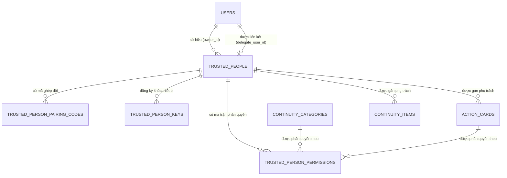
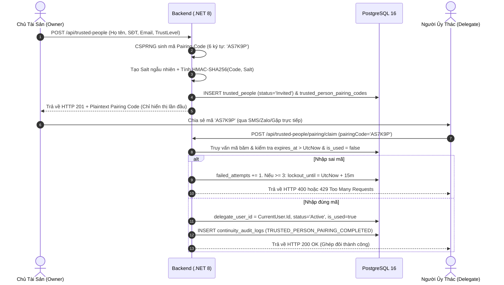

# Kế Hoạch Kiến Trúc & Quy Hoạch Kỹ Thuật (Architecture & Planning): Module 3 – Trusted People

**Mã Module:** `module3` (Tương đương `feat-03-trusted-people`)  
**Pha phát triển:** Pha 2 – Architecture & Planning  
**Vai trò đảm trách:** Principal Solution Architect & Senior Tech Lead  
**Tài liệu căn cứ:** [SPEC.md](file:///c:/DevFlutter/asseta-monorepo/.sdd/specs/module3/SPEC.md), [CONTEXT.md](file:///c:/DevFlutter/asseta-monorepo/.sdd/specs/module3/CONTEXT.md), [Constitution](file:///c:/DevFlutter/asseta-monorepo/.sdd/constitution.md)  
**Trạng thái tài liệu:** PENDING HUMAN REVIEW (Chờ Gatekeeper 1 phê duyệt trước khi chuyển sang Pha 3)  

---

## 1. Tiếp Cận Kiến Trúc Tổng Thể (Architectural Approach)

Hệ thống triển khai theo mô hình **Core & Shell** và tuân thủ chặt chẽ **Clean Architecture (.NET 8 LTS)**. Mọi logic nghiệp vụ cốt lõi, ma trận phân quyền, quản lý vòng đời ghép đôi danh tính đều nằm trong Core (`Asseta.Domain` & `Asseta.Application`), tách biệt hoàn toàn với tầng cơ sở hạ tầng (`Asseta.Infrastructure`) và các giao diện người dùng ngoại vi (`Frontend-Web` & `Mobile-App`).

```mermaid
graph TD
    subgraph Client Shell (Giao diện & Bảo mật Thiết bị)
        Web[ReactJS 18 + WebCrypto API]
        Mobile[Flutter 3.x + BLoC + Secure Storage]
    end

    subgraph API Gateway & Middlewares
        API[Asseta.Api - TrustedPeopleController]
        IdempMw[IdempotencyMiddleware - Redis TTL 24h]
        SecMw[SensitiveDataInspectionMiddleware]
        ErrMw[GlobalExceptionMiddleware - Envelope Pattern]
    end

    subgraph Core Application & Domain (Clean Architecture)
        App[Asseta.Application CQRS / MediatR]
        Domain[Asseta.Domain Entities, Rules, Enums & Events]
    end

    subgraph Infrastructure & Persistence
        Infra[Asseta.Infrastructure EF Core 8]
        Postgres[(PostgreSQL 16 Storage)]
        Redis[(Redis 7 Rate Limiter & Idempotency)]
    end

    Web -->|HTTPS + Bearer Token| API
    Mobile -->|HTTPS + Pairing Code + Public Key| API
    API --> ErrMw
    ErrMw --> SecMw
    SecMw --> IdempMw
    IdempMw --> App
    App --> Domain
    App --> Infra
    Infra --> Postgres
    App -.-> Redis
```

### Phân rã kiến trúc chi tiết:
1. **Domain Layer (`Asseta.Domain`)**:
   - Mở rộng entity `TrustedPerson` (thêm `Status`, `RoleDescription`, `RowVersion`, `DelegateUserId`, quan hệ với `Permissions` và `PairingCodes`).
   - Tạo entity `TrustedPersonPairingCode` (quản lý mã băm, muối mật mã `Salt`, số lần thử sai `FailedAttempts`, thời gian khóa `LockoutUntil`, thời hạn `ExpiresAt`, trạng thái `IsUsed`).
   - Tạo entity `TrustedPersonPermission` (quản lý phân quyền hạt nhân theo danh mục `ContinuityCategoryId` hoặc thẻ hành động `ActionCardId`).
   - Tạo domain events: `TrustedPersonCreatedEvent`, `TrustedPersonPairedEvent`, `TrustedPersonRevokedEvent`, `TrustedPersonPermissionUpdatedEvent`.
2. **Application Layer (`Asseta.Application`)**:
   - Triển khai CQRS với MediatR:
     - Commands: `CreateTrustedPersonCommand`, `UpdateTrustedPersonCommand`, `RevokeTrustedPersonCommand`, `RegeneratePairingCodeCommand`, `ClaimPairingCodeCommand`, `UpdateScopedPermissionsCommand`, `RegisterDevicePublicKeyCommand`.
     - Queries: `GetTrustedPeopleQuery`, `GetTrustedPersonDetailQuery`, `GetScopedAccessMatrixQuery`, `GetAssignedRolesForDelegateQuery`.
     - Event Handlers: `TrustedPersonRevokedEventHandler` (tự động unassign trên `ContinuityItem` và `ActionCard`, tính toán lại `ReadinessScore` và kích hoạt cờ `has_continuity_gap`).
     - FluentValidation: Kiểm tra chặt chẽ độ dài, định dạng email, regex số điện thoại, giới hạn 5 người, và điều kiện phân quyền.
3. **Infrastructure Layer (`Asseta.Infrastructure`)**:
   - Cấu hình EF Core 8: `TrustedPersonConfiguration`, `TrustedPersonPairingCodeConfiguration`, `TrustedPersonPermissionConfiguration`.
   - Migration tự động trên PostgreSQL 16.
   - `IPairingCodeHasher`: Dịch vụ băm một chiều HMAC-SHA256 với Salt chuẩn mật mã.
4. **API Layer (`Asseta.Api`)**:
   - `TrustedPeopleController`: Đầy đủ các endpoints RESTful, gắn `[Authorize]`, kiểm soát đa người dùng theo `CurrentUserProvider`.
5. **Frontend Web & Mobile App**:
   - React: Màn hình quản lý Trusted People, Drawer cấu hình Ma Trận Phân Quyền, Modal hiển thị mã Pairing Code & QR Code.
   - Flutter: Màn hình danh sách người ủy thác (Owner view), BLoC `TrustedPeopleBloc`, Màn hình nhập mã ghép đôi (Delegate view), lưu trữ `client_public_key` trong `FlutterSecureStorage`.

---

## 2. Thiết Kế Cơ Sở Dữ Liệu Chi Tiết (PostgreSQL 16 Schema)



### Bảng dữ liệu chi tiết:
- `trusted_people`: Lưu trữ thông tin định danh, cấp bậc tin cậy, trạng thái vòng đời.
- `trusted_person_pairing_codes`: Lưu trữ mã băm an toàn, thời gian sống 48 giờ, bộ đếm thử sai chống brute-force.
- `trusted_person_permissions`: Lưu ma trận phân quyền theo danh mục (`Category`) hoặc theo thẻ (`ActionCard`).
- `trusted_person_keys`: Lưu trữ Public Key thiết bị phục vụ E2EE envelope trong tương lai.

---

## 3. Hợp Đồng Giao Diện Lập Trình (API Contracts)

Mọi API tuân thủ tiêu chuẩn Envelope Contract được định nghĩa trong `shared_context.md`.

### 3.1. Danh Sách Endpoints

| Phương thức | Đường dẫn API | Chức năng | Phân quyền |
| :--- | :--- | :--- | :--- |
| `GET` | `/api/trusted-people` | Lấy danh sách Người Ủy Thác của Owner | Owner |
| `GET` | `/api/trusted-people/{id}` | Lấy chi tiết thông tin và phân quyền của một Người Ủy Thác | Owner |
| `POST` | `/api/trusted-people` | Tạo mới Người Ủy Thác & sinh mã ghép đôi | Owner |
| `PUT` | `/api/trusted-people/{id}` | Cập nhật hồ sơ Người Ủy Thác | Owner |
| `DELETE` | `/api/trusted-people/{id}` | Xóa mềm / Thu hồi Người Ủy Thác | Owner |
| `POST` | `/api/trusted-people/{id}/pairing-code/regenerate` | Cấp lại mã ghép đôi mới | Owner |
| `POST` | `/api/trusted-people/pairing/claim` | Nhập mã ghép đôi để liên kết danh tính | Authenticated Delegate |
| `GET` | `/api/trusted-people/{id}/permissions` | Lấy ma trận phân quyền của Người Ủy Thác | Owner |
| `PUT` | `/api/trusted-people/{id}/permissions` | Cập nhật ma trận phân quyền | Owner |
| `POST` | `/api/trusted-people/device-key` | Đăng ký Public Key thiết bị của Người Ủy Thác | Authenticated Delegate |
| `GET` | `/api/trusted-people/my-delegated-roles` | Xem danh sách các vai trò được ủy thác (Zero-Disclosure) | Authenticated Delegate |

### 3.2. Payload Chi Tiết Ví Dụ

#### `POST /api/trusted-people` (Tạo Mới & Sinh Mã)
- **Request Body:**
```json
{
  "fullName": "Nguyễn Văn B",
  "email": "nguyenvanb@example.com",
  "phoneNumber": "+84901234567",
  "relationship": "Luật sư riêng",
  "roleDescription": "Phụ trách hồ sơ pháp lý và hợp đồng kinh doanh",
  "trustLevel": 2
}
```
- **Response Body (201 Created):**
```json
{
  "success": true,
  "data": {
    "id": "e4b2d35c-8a12-4c22-b5e1-857c0f18a29a",
    "fullName": "Nguyễn Văn B",
    "email": "nguyenvanb@example.com",
    "phoneNumber": "+84901234567",
    "relationship": "Luật sư riêng",
    "roleDescription": "Phụ trách hồ sơ pháp lý và hợp đồng kinh doanh",
    "trustLevel": 2,
    "status": "Invited",
    "pairingCode": "AS7K9P",
    "pairingExpiresAt": "2026-09-07T14:30:00Z",
    "rowVersion": 1,
    "createdAt": "2026-09-05T14:30:00Z"
  },
  "error": null,
  "meta": {
    "timestamp": "2026-09-05T14:30:00Z",
    "correlationId": "f7a3b2..."
  }
}
```

#### `POST /api/trusted-people/pairing/claim` (Ghép Đôi Danh Tính)
- **Request Body:**
```json
{
  "pairingCode": "AS7K9P"
}
```
- **Response Body (200 OK):**
```json
{
  "success": true,
  "data": {
    "trustedPersonId": "e4b2d35c-8a12-4c22-b5e1-857c0f18a29a",
    "ownerDisplayName": "Trần Văn A",
    "assignedRole": "Phụ trách hồ sơ pháp lý và hợp đồng kinh doanh",
    "status": "Active",
    "pairedAt": "2026-09-05T14:35:00Z"
  },
  "error": null,
  "meta": {
    "timestamp": "2026-09-05T14:35:00Z",
    "correlationId": "c4d1e2..."
  }
}
```

#### `PUT /api/trusted-people/{id}/permissions` (Cập Nhật Ma Trận Phân Quyền)
- **Request Body:**
```json
{
  "categoryPermissions": [
    { "categoryId": "11111111-1111-1111-1111-111111111114", "canView": true },
    { "categoryId": "11111111-1111-1111-1111-111111111115", "canView": true }
  ],
  "actionCardPermissions": []
}
```

---

## 4. Luồng Mật Mã & Ghép Đôi Danh Tính (Cryptographic Flow)



---

## 5. Tương Tác Giữa Các Module & Xử Lý Sự Kiện Miền (Domain Events)

1. **Gán Người Ủy Thác cho Continuity Item & Action Card**:
   - Khi `AssignedTrustedPersonId` được thiết lập trên một hạng mục hoặc thẻ hành động, hệ thống kiểm tra sự hoàn tất của các trường bắt buộc khác (vị trí tài liệu, ít nhất 1 bước hành động).
   - Nếu đầy đủ, phát sinh sự kiện nội bộ kích hoạt `ReadinessScoreCalculator` nâng điểm danh mục và xóa bỏ cờ `has_continuity_gap`.
2. **Thu Hồi (Revoke) hoặc Xóa Mềm Người Ủy Thác**:
   - Khi Người Ủy Thác bị xóa hoặc chuyển sang `Revoked`, Handler `TrustedPersonRevokedEventHandler` sẽ:
     - Quét tất cả `ContinuityItem` và `ActionCard` có `AssignedTrustedPersonId == RevokedId`.
     - Cập nhật `AssignedTrustedPersonId = NULL`.
     - Tự động bật lại cờ `has_continuity_gap = true` nếu item đó có mức ưu tiên `Critical` hoặc `Important`.
     - Tính toán giảm điểm `ReadinessScore` tương ứng và ghi log kiểm toán.

---

## 6. Phân Tích Rủi Ro Kỹ Thuật & Biện Pháp Giảm Thiểu (Risks & Mitigation)

| STT | Rủi ro kỹ thuật | Mức độ | Biện pháp giảm thiểu & Thiết kế phòng ngừa |
| :--- | :--- | :---: | :--- |
| **1** | Tấn công Brute-force dò quét mã Pairing Code 6 ký tự | **Cao** | Khóa tạm thời 15 phút nếu nhập sai quá 3 lần liên tiếp; giới hạn tốc độ gọi API trên Redis (5 requests/phút/IP); mã hết hạn sau 48h và chỉ sử dụng 1 lần duy nhất. |
| **2** | Rò rỉ dữ liệu tài sản cho Người Ủy Thác khi Owner còn khỏe mạnh (Premature Disclosure) | **Nghiêm trọng** | Áp dụng triệt để nguyên tắc **Zero-Disclosure in Normal State**. Mọi API truy vấn dữ liệu chi tiết của Action Card hay Continuity Map bắt buộc kiểm tra xem Safe Activation (Module 5) đã được kích hoạt hay chưa. Người Ủy Thác ở trạng thái bình thường chỉ nhận được vai trò tóm tắt. |
| **3** | Xung đột phiên bản khi nhiều thiết bị cùng phân quyền hoặc cập nhật trạng thái | **Trung bình** | Sử dụng cờ kiểm soát tương tranh lạc quan `row_version` trên bảng `trusted_people`. Trả về mã lỗi HTTP 409 `CONCURRENT_STATE_MUTATION` nếu phát hiện sai lệch phiên bản. |
| **4** | Ghost Reference khi xóa Trusted Person đang gắn với hàng loạt Action Cards | **Trung bình** | Triển khai Domain Event `TrustedPersonRevokedEvent` xử lý unassign an toàn, đưa về `NULL` có kiểm toán thay vì xóa cascade làm mất thẻ hành động. |

---

## 7. Câu Hỏi Dành Cho Người Dùng & Checkpoint Gatekeeper 1

Trước khi tiến hành phân rã `TASKS.md` (Pha 3) và bắt tay vào triển khai mã nguồn (Pha 4), AI Solution Architect đề xuất checkpoint này để Human Product Lead rà soát các giả định:

1. **Giới hạn số lượng Trusted People**: MVP ấn định tối đa 5 người, khuyến nghị 1–3 người. Quý người dùng có muốn tăng hoặc giảm giới hạn này không?
2. **Cơ chế chia sẻ mã Pairing Code**: Hiện tại hỗ trợ sao chép thủ công (Copy to Clipboard) hoặc chia sẻ link mở app trực tiếp qua Deep Link. Phương án này đã tối ưu cho MVP chưa?
3. **Phân quyền theo Danh mục vs Thẻ**: Kiến trúc hỗ trợ cả 2 cấp độ (Toàn bộ danh mục hoặc từng Action Card cụ thể). Quý người dùng có đồng ý với thiết kế Ma Trận Phân Quyền này không?

---
🛑 **GATEKEEPER 1 CHECKPOINT**: Agent tạm dừng tại đây và chờ lệnh phê duyệt `PLAN.md` từ Human Product Lead trước khi kích hoạt Pha 3 (`TASKS.md`) và Pha 4 (`Implementation`).
